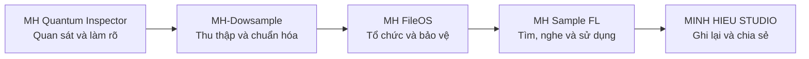

<div align="center">

# MINH HIEU STUDIO

### Âm nhạc, quy trình cá nhân và hệ sinh thái công cụ MH


[Website](https://studiominhhieu.com/) · [GitHub](https://github.com/studiozengermany-cmd) · [Liên hệ](mailto:support@studiominhhieu.com)

</div>

> [!IMPORTANT]
> MINH HIEU STUDIO là website cá nhân và nơi ghi lại quá trình Minh Hiếu làm nhạc, học công nghệ và xây dựng các công cụ phục vụ công việc thật. Một dự án xuất hiện trên website không có nghĩa dự án đó đã hoàn thiện, đã thương mại hóa hoặc phù hợp cho mọi người sử dụng.

## Mục lục

- [MINH HIEU STUDIO là gì?](#minh-hieu-studio-là-gì)
- [Câu chuyện của Minh Hiếu](#câu-chuyện-của-minh-hiếu)
- [Hệ sinh thái MH](#hệ-sinh-thái-mh)
- [Các dự án chính](#các-dự-án-chính)
- [Nguyên tắc xây dựng](#nguyên-tắc-xây-dựng)
- [Cách website mô tả trạng thái dự án](#cách-website-mô-tả-trạng-thái-dự-án)
- [Công nghệ website](#công-nghệ-website)
- [Chạy website ở máy local](#chạy-website-ở-máy-local)
- [Cấu trúc repository](#cấu-trúc-repository)
- [Triển khai](#triển-khai)
- [Liên hệ](#liên-hệ)

## MINH HIEU STUDIO là gì?

MINH HIEU STUDIO là không gian công khai để:

- giới thiệu hoạt động âm nhạc và DJ của Minh Hiếu;
- lưu lại ghi chú, archive và quy trình làm việc;
- giới thiệu những công cụ đang được xây dựng từ nhu cầu thực tế;
- công khai source, test hoặc bằng chứng kỹ thuật khi phù hợp;
- chia sẻ những gì đã học được với người khác khi dự án đủ rõ ràng và an toàn.

Website không mặc định là cửa hàng, công ty phần mềm hoàn chỉnh hay dịch vụ có cam kết thương mại.

## Câu chuyện của Minh Hiếu

Minh Hiếu không bắt đầu từ nền tảng học lập trình chính quy. Điểm bắt đầu là những công việc lặp đi lặp lại trong quá trình làm nhạc và quản lý dữ liệu:

- tải và phân loại sample;
- dọn file và tìm dữ liệu bị trùng;
- nhớ sample nào đã dùng trong project;
- quan sát giao diện và mô tả lỗi cho AI;
- giảm thời gian dành cho thao tác kỹ thuật để tập trung hơn vào sáng tạo.

AI được sử dụng như một công cụ hỗ trợ nghiên cứu và thực hiện. AI không thay thế người quyết định dự án phải làm gì, giới hạn nào được chấp nhận và kết quả cuối cùng có đúng với nhu cầu thực tế hay không.

```text
Vấn đề thật trong công việc
→ Minh Hiếu xác định mục tiêu
→ AI hỗ trợ chia nhỏ và thực hiện
→ Kiểm tra bằng dữ liệu thật
→ Ghi rõ phần đã làm và chưa làm
→ Chỉ chia sẻ khi đủ ổn định
```

## Hệ sinh thái MH

Các dự án có tiền tố **MH** được xây dựng như một chuỗi có liên kết, không phải các repository rời rạc.



### Ý nghĩa của chuỗi

1. **Quan sát và làm rõ:** xác định đúng vấn đề, giao diện hoặc yêu cầu trước khi bắt đầu sửa.
2. **Thu thập và chuẩn hóa:** kiểm tra, phân loại và chuẩn hóa sample theo quy trình có cảnh báo.
3. **Tổ chức và bảo vệ:** hiểu dữ liệu, lập chỉ mục và chuẩn bị thao tác an toàn.
4. **Tìm và sử dụng:** đưa thư viện sample vào quy trình làm nhạc với FL Studio.
5. **Ghi lại và chia sẻ:** công khai hành trình, bằng chứng, giới hạn và bài học.

## Các dự án chính

| Dự án | Vai trò | Trạng thái cần hiểu |
|---|---|---|
| [MH Quantum Inspector](https://github.com/studiozengermany-cmd/MH-Quantum-Inspector) | Lấy ngữ cảnh DOM/CSS để mô tả vấn đề rõ hơn cho AI | Công cụ phát triển cá nhân, chưa security audit |
| [MH-Dowsample](https://github.com/studiozengermany-cmd/MH---DOWSAMPLE-PRO) | Kiểm tra, phân loại và sắp xếp sample | Có thể di chuyển file; phải dry-run và backup |
| [MH FileOS](https://github.com/studiozengermany-cmd/MH-FileOS) | Nghiên cứu tổ chức file an toàn và có phục hồi | Hiện mới là read-only slice trên fixture |
| [MH Sample FL](https://github.com/studiozengermany-cmd/MH-SAMPLE-FL-2026-) | Quản lý, preview và ghi nhớ sample trong workflow FL Studio | `v0.1.0-alpha`, còn nhiều runtime gate chưa nghiệm thu |
| [MINH HIEU STUDIO](https://github.com/studiozengermany-cmd/studio-minh-hieu) | Website và nơi kể câu chuyện chung | Website công khai, không mặc định là dịch vụ thương mại |

> [!NOTE]
> Một số repository có thể đang để Private. Khi đó người ngoài sẽ không truy cập được dù đường dẫn được ghi trong bảng.

## Nguyên tắc xây dựng

1. **Nhu cầu thật trước:** dự án phải bắt đầu từ một vấn đề đang tồn tại trong công việc.
2. **Người dùng quyết định:** AI hỗ trợ thực hiện, không tự quyết định mục tiêu sản phẩm.
3. **Local-first khi phù hợp:** ưu tiên dữ liệu ở máy người dùng và quyền kiểm soát rõ ràng.
4. **Không phá dữ liệu:** thao tác rủi ro phải có cảnh báo, xem trước và khả năng kiểm chứng.
5. **Không phóng đại:** không gọi bản build, mockup hoặc demo là sản phẩm hoàn thiện.
6. **Bằng chứng trước tuyên bố:** trạng thái phải dựa trên source, test, log, ảnh hoặc video thật.
7. **Cá nhân trước, cộng đồng sau:** làm cho nhu cầu cá nhân trước; chỉ chia sẻ khi đủ ổn định.
8. **README phải có ích:** phải nói rõ đây là gì, dùng thế nào, giới hạn ở đâu và người đọc nên bắt đầu từ đâu.

## Cách website mô tả trạng thái dự án

Website và README phải sử dụng đúng từ theo bằng chứng:

| Trạng thái | Khi nào được dùng |
|---|---|
| Ý tưởng | Chưa có source hoặc hành vi chạy được |
| Thử nghiệm | Có source hoặc demo nhưng chưa có kiểm chứng đầy đủ |
| Alpha | Có workflow chính nhưng còn lỗi và gate chưa nghiệm thu |
| Beta | Đã có người dùng thử thực tế và quy trình phản hồi |
| Stable | Có tiêu chí phát hành, test và hỗ trợ rõ ràng |

Không được:

- gọi dự án là production-ready khi chưa có bằng chứng;
- dùng mockup hoặc placeholder như dữ liệu thật;
- gọi file `.exe` là bản phát hành chỉ vì build thành công;
- gọi native file drag là tích hợp sâu với FL Studio;
- gọi một extension an toàn khi chưa kiểm tra quyền và dữ liệu;
- mô tả dự án là thương mại nếu chủ dự án chưa quyết định thương mại hóa.

Tên sản phẩm quản lý sample chính thức là **MH Sample FL**. Không tiếp tục dùng “SampleGuard FL” như tên sản phẩm hiện tại.

## Công nghệ website

- HTML5 cho cấu trúc nội dung.
- CSS3, Grid, Flexbox và CSS custom properties.
- JavaScript cho menu, tương tác và hiệu ứng.
- GSAP và ScrollTrigger cho một số animation.
- GitHub Pages cho triển khai.
- Custom domain `studiominhhieu.com`.

Hiệu ứng hình ảnh phục vụ trải nghiệm, nhưng không được che khuất nội dung, trạng thái dự án hoặc thông tin quan trọng.

## Chạy website ở máy local

### Clone repository

```bash
git clone https://github.com/studiozengermany-cmd/studio-minh-hieu.git
cd studio-minh-hieu
```

### Chạy static server

```bash
python -m http.server 8000
```

Mở:

```text
http://localhost:8000
```

Có thể mở trực tiếp `index.html`, nhưng dùng static server giúp kiểm tra đường dẫn và tài nguyên gần với môi trường triển khai hơn.

## Cấu trúc repository

```text
studio-minh-hieu/
├─ assets/
│  ├─ images/
│  └─ media/
├─ css/
│  └─ styles.css
├─ js/
│  └─ main.js
├─ 404.html
├─ index.html
├─ CNAME
├─ robots.txt
├─ sitemap.xml
└─ README.md
```

Tên và cấu trúc thực tế có thể thay đổi theo phiên bản. Khi tài liệu và repository khác nhau, cần cập nhật README thay vì để hướng dẫn cũ tồn tại.

## Triển khai

Website được triển khai từ GitHub Pages và dùng custom domain:

```text
https://studiominhhieu.com/
```

Trước khi cập nhật nhánh chính cần kiểm tra:

- link nội bộ và link repository;
- email liên hệ;
- tên dự án chính thức;
- giao diện mobile;
- ảnh và video có tải được không;
- sitemap, robots và canonical URL;
- nội dung có tuyên bố quá mức hay không.

## Liên hệ

Mọi liên hệ chính thức về website và các dự án công khai sử dụng:

- Email: support@studiominhhieu.com
- Website: https://studiominhhieu.com/
- GitHub: https://github.com/studiozengermany-cmd

---

<div align="center">

**Tối ưu công việc thật. Dùng AI có kiểm soát. Chia sẻ khi đủ rõ ràng và an toàn.**

</div>
